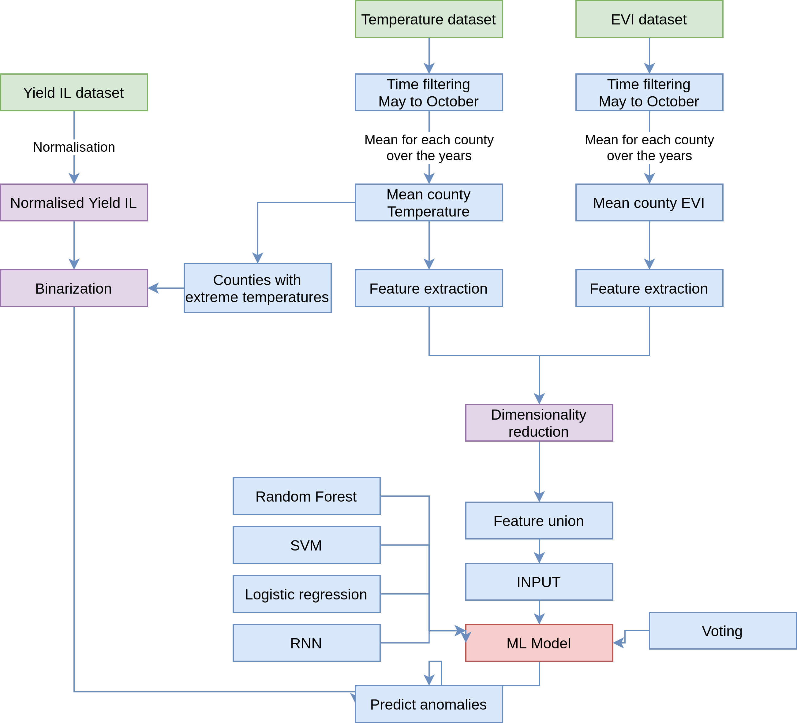
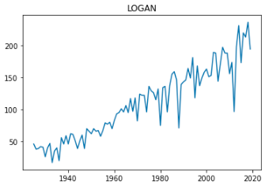
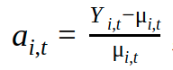
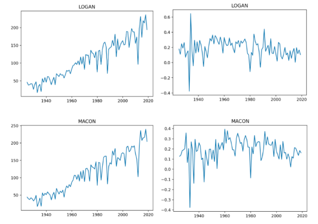
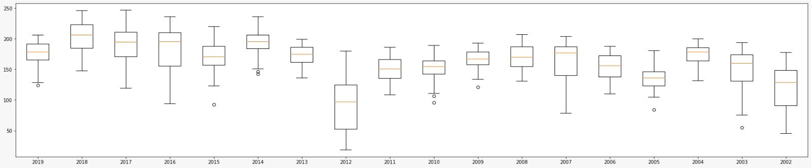
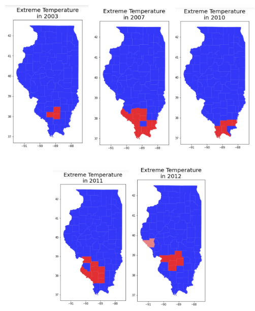

# Imperial_Hackathon_2021

## Introduction
One of the most damaging effects that climate change is having is on crop yields. Extreme wether is more comon now than years ago, reason for wich due to droughts, floods, high and low temperatures there is a need to model the behaviour that we are experimenting.

## Pipeline

### Data Analysis
#### Normalisation
At first glance, the data in the Yield field dataset (IL_yield.csv) follows an increasing tendency, similarly to an exponential behaviour. Such behaviour could be caused by the population growth over the years, increase of land devoted to agricultural purposes, acquisition of more advanced and specialized machinery (irrigation techniques, parameter modelling with GPS...), the discovery of more optimal harvesting methodologies, among others. Hence, the application of a normalization method to fairly compare the time evolution between the crop yield together with other explanatory variables is required. 

The normalization is carried out following the procedure proposed by “Reference of the paper https://royalsocietypublishing.org/doi/10.1098/rstb.2019.0510”, which also analysed a similar dataset. To carry out the operations, the following formula is used: 

Where ai,t is the normalized value of the specific county i and year t,  Yi,t is a specific raw value for a county i and a year t, and  i,t is the mean of all the counties’s yields in a specific year t. 
As it can be seen in the next illustration, the right charts are successfully normalized, correcting the exponential tendency of the raw yield data.  

#### Data comprehension
In order to do a comprasion between the crops in the timeline, a boxplot has been performed to see if there is any anomaly in some county or if there is any year with an extreme behaviour.

As can be seen the 2011 was the year in which less yield was cropped. That should be taken into account when applying a model, due to the fact that in the whole data that year represents an outlier by itself. Can be noticed that the other years even having some variability between them they follow a similiar tendency, for that reason 2011 should be dropped on the historical data.

#### Hypothesis test 
According to the literature provided [2] , temperatures above 30ºC are considered extreme and seriously damage crop yield. Consequently, the temperature dataset has been deeply studied to assess the counties and years in which temperature records exceeded that threshold with the aim to give an insight in the correlation of the crop yield performance with extreme weather events. 
To do so, we first filtered the dataset to obtain those observations with temperatures above 30ºC. In addition, to account not only for the presence of a single extreme value in a given month, but of a certain amount of them, the time difference between readings has been computed. Temperature readings are given the days 1, 15, 28 days of each month. The amount of continuous extreme events that have happened per county and per year have been assessed and a filter has been applied in order to find how many consecutives days with high temperatures have happend in each year. At the end we filtered for those counties and years in which more than four times we have had at least two consecuitve readings with a high temperature.

