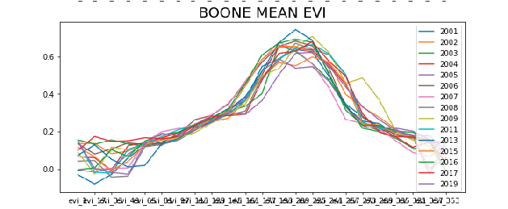
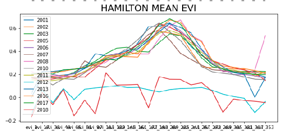
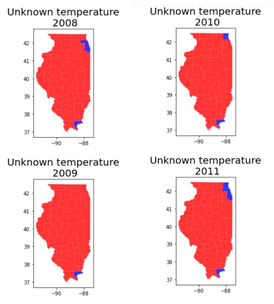
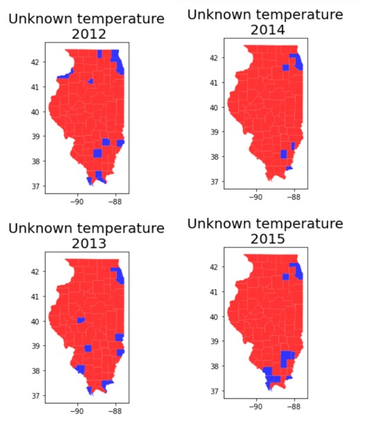
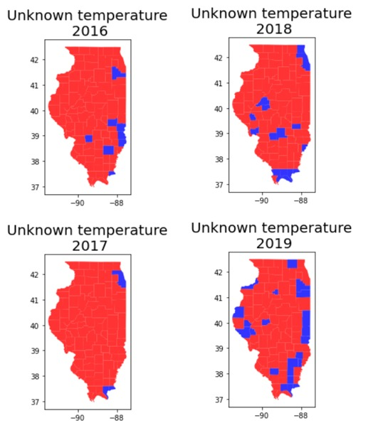

# Imperial_Hackathon_2021

## Introduction
Crop yields are not exempt of suffering from the manifold damaging effects climate change is responisble of. Extreme weather is more common now than ages ago, reason for which, droughts, floods, high and low temperatures there is a need to model the behaviour that we are experimenting.

## Pipeline

## Data Analysis
#### Normalisation
At first glance, the data in the Yield field dataset (IL_yield.csv) follows an increasing tendency, similarly to an exponential behaviour. Such behaviour could be caused by the population growth over the years, increase of land devoted to agricultural purposes, acquisition of more advanced and specialized machinery (irrigation techniques, parameter modelling with GPS...), the discovery of more optimal harvesting methodologies, among others. Hence, the application of a normalization method to fairly compare the time evolution between the crop yield together with other explanatory variables is required. 


The normalization is carried out following the procedure proposed by “Reference of the paper https://royalsocietypublishing.org/doi/10.1098/rstb.2019.0510”, which also analysed a similar dataset. To carry out the operations, the following formula is used: 


Where ai,t is the normalized value of the specific county i and year t,  Yi,t is a specific raw value for a county i and a year t, and  i,t is the mean of all the counties’s yields in a specific year t. 
As it can be seen in the next illustration, the right charts are successfully normalized, correcting the exponential tendency of the raw yield data.  


#### Data comprehension
In order to do a comprasion between the crops in the timeline, a boxplot has been performed to see if there is any anomaly in some county or if there is any year with an extreme behaviour.

As can be seen the 2011 was the year in which less yield was cropped. That should be taken into account when applying a model, due to the fact that in the whole data that year represents an outlier by itself. Can be noticed that the other years even having some variability between them they follow a similiar tendency, for that reason 2011 should be dropped on the historical data.


For the EVI dataset a series of line charts have been performed in order to make a visual analysis and check if there is any year in which we have a notable difference in the EVI. 
As can be seen there is a season in which the EVI is higher, there is a substantial amount that is due to the crops, for that reason a change would indicate a lower crop. 
In order to visualize it, can be seen how Hamilton has a significant change while Boone has a similiar behaviour.





#### Hypothesis test 
According to the literature provided [2] , temperatures above 30ºC are considered extreme and seriously damage crop yield. Consequently, the temperature dataset has been deeply studied to assess the counties and years in which temperature records exceeded that threshold with the aim to give an insight in the correlation of the crop yield performance with extreme weather events. 
To do so, we first filtered the dataset to obtain those observations with temperatures above 30ºC. In addition, to account not only for the presence of a single extreme value in a given month, but of a certain amount of them, the time difference between readings has been computed. Temperature readings are given the days 1, 15, 28 days of each month. The amount of continuous extreme events that have happened per county and per year have been assessed and a filter has been applied in order to find how many consecutives days with high temperatures have happend in each year. At the end we filtered for those counties and years in which more than four times we have had at least two consecuitve readings with a high temperature.


From here on a study should be performed to analyze these results with the crop yields of that year in that county.


#### Null values
In the temperature dataset we have found some null values, reason for which they must be filled. Here can be found the counties with missing values.
```
{'ALEXANDER': [2012, 2013, 2015], 'BOND': [2016, 2018, 2013], 'BOONE': [2012], 'BROWN': [2019], 'CLARK': [2016, 2019, 2013], 'CLAY': [2012], 'COLES': [2016], 'COOK': [2017, 2018, 2008, 2011, 2012, 2013, 2014, 2015], 'CRAWFORD': [2016], 'CUMBERLAND': [2018], 'EDGAR': [2019], 'EDWARDS': [2019, 2014, 2015], 'FAYETTE': [2018], 'HAMILTON': [2019, 2014, 2015], 'HANCOCK': [2019], 'HARDIN': [2016, 2017, 2018, 2019, 2008, 2009, 2010, 2011, 2013, 2014, 2015], 'JACKSON': [2015], 'JEFFERSON': [2012], 'JERSEY': [2018], 'JOHNSON': [2018, 2019, 2012, 2015], 'KANKAKEE': [2019], 'KENDALL': [2014, 2015], 'LAKE': [2010, 2011, 2012, 2018], 'LAWRENCE': [2016, 2012, 2013], 'MASON': [2018], 'MASSAC': [2018, 2012], 'MCHENRY': [2019], 'MENARD': [2018, 2019, 2013], 'PERRY': [2019], 'PIKE': [2019], 'POPE': [2017, 2018, 2019, 2008, 2009, 2010, 2011, 2013], 'PULASKI': [2018], 'PUTNAM': [2019, 2012], 'RANDOLPH': [2013], 'RICHLAND': [2019], 'ROCK ISLAND': [2019, 2012], 'SALINE': [2019], 'SCOTT': [2018, 2019], 'UNION': [2018, 2015], 'VERMILION': [2019], 'WABASH': [2018], 'WAYNE': [2016, 2019, 2015], 'WILL': [2016, 2019]}
```
Thanks to the insight provided in the previous section can be seen how the temperatures in one county can have a symilar effect in the boudaries of it. Also some statistical tests have been done with a positive result indicatig that similar temperatures are found in nearby counties. For that reason, due to the fact that in the temperature dataset we have missig values, our procedure has been to full them with the average of the adjacent counties.
Here can be seen for each year which counties have missing values:





### Conclusions
In brief, the nan values of temperature have been filed based on the study made in which the hypothesis of the relationship between between the nearest counties temperature has not been denied. On the other side the nan values in the crop yield are filled thanks to the comprehension of the behaviour among all the years.

## Modeling
Two aproaches have been made in order to predict whether a year would be good or bad.
In first place, based on the normalized data for each county and yield crop a SARIMA model has been applied in order to predict the following year. Eben thought not being the most proper method, has enabled us to learn about the field. Now we would do a SARIMAX using exogenous variables, in with the exogenous variable would be the EVI indicator. It is known that the crop is done in September and October, for that reason doing an average between the previous months (May-Agst) and using it as the exogen will enable us when it comes to the next year to provide it and having the approximate value of the crop. 
Instead of returning us a value and using it directly the best would be to have a trust band whith a width of 20% respect to the average of the 
wever a multivariable apporach would must be a further approach in order to m

