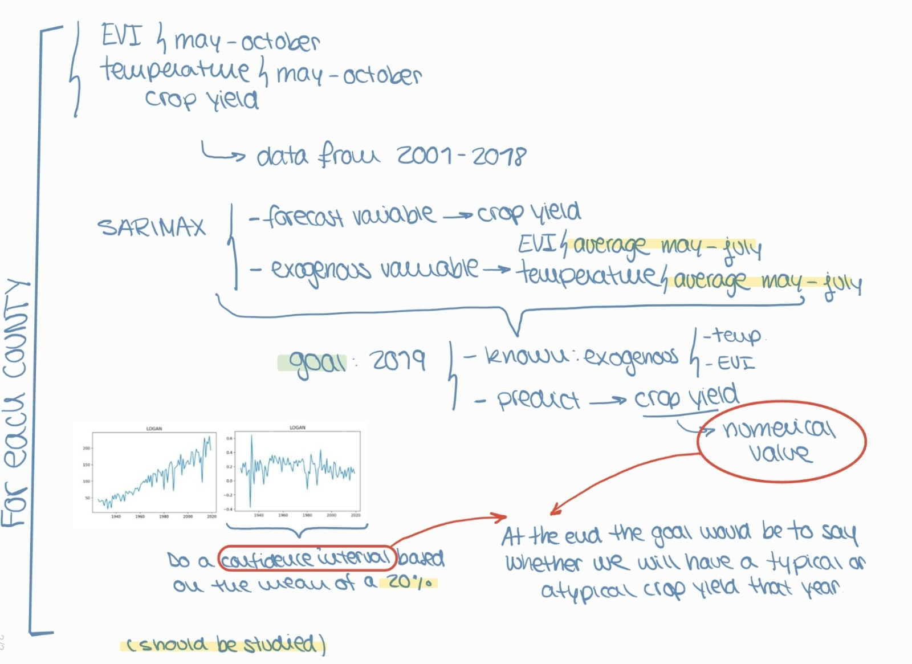

# Imperial_Hackathon_2021
CODE:https://drive.google.com/file/d/1SjF2VXC0kamHkwyOwa8Vk42mJVguRq2y/view?usp=sharing
(Too heavy for uploading in github)

## Introduction
Crop yields are not exempt of suffering from the manifold damaging effects climate change is responsible of. Extreme weather is more common now than ages ago, reason for which, droughts, floods, high and low temperatures, among others,  and it is required to model such behaviour.

## Data Analysis
#### Normalisation
At first glance, the data in the Yield field dataset (IL_yield.csv) follows an increasing tendency, similarly to an exponential behaviour. Such behaviour could be caused by the population growth over the years, increase of land devoted to agricultural purposes, acquisition of more advanced and specialized machinery (irrigation techniques, parameter modelling with GPS...), the discovery of more optimal harvesting methodologies, among others. Hence, the application of a normalization method to fairly compare the time evolution between the crop yield together with other explanatory variables is required. 


The normalization is carried out following the procedure proposed by “Reference of the paper https://royalsocietypublishing.org/doi/10.1098/rstb.2019.0510”, which also analysed a similar dataset. To carry out the operations, the following formula is used: 


Where ai,t is the normalized value of the specific county i and year t,  Yi,t is a specific raw value for a county i and a year t, and  i,t is the mean of all the counties’ yields in a specific year t. 
As it can be seen in the next illustration, the right charts are successfully normalized, correcting the exponential tendency of the raw yield data. 


#### Data comprehension
For the sake of comparison between the crops in the timeline, a boxplot has been conducted to explore anomalies in some county or if there is any year with an extreme behaviour.

As it can be seen, year 2012 was the one with the lowest crop yield. This should be taken into account when conducting a model, due to the fact that in the whole data, such observation is outlier itself. Furthermore, it should be noticed that the other years, despite the existence of some variability between them, they do follow a similar tendency. Subsequently, year 2012 should be dropped out on the historical data.


For the EVI dataset, a series of line charts have been performed in order to make a visual analysis and check if there is any year in which we have a notable difference in the EVI. 
As it can be seen, there is a season in which the EVI is higher overall. This means that crops are healthier. Similarly, changes in EVI would indicate a variation in the crop state. 
With the aim of visualized such behaviour, note the county of Hamilton has a significant variation (lines are dispersed) while Boone has a rather more stable behaviour (lines are closer).


#### Hypothesis test 
According to the literature provided [2] , temperatures above 30ºC are considered extreme and seriously damage crop yield. Consequently, the temperature dataset has been deeply studied to assess the counties and years in which temperature records exceeded that threshold with the aim to give an insight in the correlation of the crop yield performance with extreme weather events. 
To do so, we first filtered the dataset to obtain those observations with temperatures above 30ºC. In addition, to account not only for the presence of a single extreme value in a given month, but of a certain amount of them, the time difference between readings has been computed. Temperature readings are given in the days 1, 15, 28 of each month. The amount of continuous extreme events that have happened per county and per year have been assessed and a filter has been applied in order to find how many consecutives days with high temperatures have occurred in each year. At the end, we filtered for those counties and years in which more than four times there were at least two consecutive readings with a high temperature.


From here on, a study should be performed to analyse these results with the crop yields of that year in that county.

#### Null values
In the temperature dataset we have found some null values, reason for which they must be filled. Here there can be found the counties with missing values.
```
{'ALEXANDER': [2012, 2013, 2015], 'BOND': [2016, 2018, 2013], 'BOONE': [2012], 'BROWN': [2019], 'CLARK': [2016, 2019, 2013], 'CLAY': [2012], 'COLES': [2016], 'COOK': [2017, 2018, 2008, 2011, 2012, 2013, 2014, 2015], 'CRAWFORD': [2016], 'CUMBERLAND': [2018], 'EDGAR': [2019], 'EDWARDS': [2019, 2014, 2015], 'FAYETTE': [2018], 'HAMILTON': [2019, 2014, 2015], 'HANCOCK': [2019], 'HARDIN': [2016, 2017, 2018, 2019, 2008, 2009, 2010, 2011, 2013, 2014, 2015], 'JACKSON': [2015], 'JEFFERSON': [2012], 'JERSEY': [2018], 'JOHNSON': [2018, 2019, 2012, 2015], 'KANKAKEE': [2019], 'KENDALL': [2014, 2015], 'LAKE': [2010, 2011, 2012, 2018], 'LAWRENCE': [2016, 2012, 2013], 'MASON': [2018], 'MASSAC': [2018, 2012], 'MCHENRY': [2019], 'MENARD': [2018, 2019, 2013], 'PERRY': [2019], 'PIKE': [2019], 'POPE': [2017, 2018, 2019, 2008, 2009, 2010, 2011, 2013], 'PULASKI': [2018], 'PUTNAM': [2019, 2012], 'RANDOLPH': [2013], 'RICHLAND': [2019], 'ROCK ISLAND': [2019, 2012], 'SALINE': [2019], 'SCOTT': [2018, 2019], 'UNION': [2018, 2015], 'VERMILION': [2019], 'WABASH': [2018], 'WAYNE': [2016, 2019, 2015], 'WILL': [2016, 2019]}
```
Thanks to the insight provided in the previous section, it can be seen how the temperatures in one county can have a similar effect in their neighbours. Moreover, some statistical tests have been done with a positive result indicating that similar temperatures are found in nearby counties. For that reason, due to the fact that in the temperature dataset we have missing values, our procedure has been to replace them by the average of the adjacent counties.
For every year, the counties presenting missing values are:


#### Student T-Test
A Student T-Test has been conducted to assess whether the assumption that there exists a relation between counties showing extreme temperature events and crop yield performance. Given the set of counties (warm_counties) presenting extreme temperatures and the annual crop yield, two populations were constructed: extreme temperature counties and normal temperature countries. 
The test is used to analyse if there is significant statistical evidence to ensure that they are different, and thereby, conclude that there exists a relation between extreme temperature and crop yield. After computing the p-value, we conclude that the null hypothesis (that there is not such difference in populations) can be rejected. 


### Conclusions
By means of the conclusion of the previously discussed statistical test, we can infer that it is reasonable to fill the nan values of temperature with the temperature of the nearest counties. On the other side, the nan values in the crop yield are filled thanks to the comprehension of the behaviour among all the years.

## Modeling
Two approaches have been made in order to predict whether a year would be good or bad. This is, whether the crop yield will be high or low. 
Firstly, based on the normalized data for each county and yield crop, a SARIMA model has been applied in order to predict the following year so as to broaden our knowledge on the field of time series forecasting. 
Thanks to the knowledge acquired after developing the SARIMA model and finding improved options from the literature review, we would suggest that a SARIMAX model would outperform SARIMA. The available data would be temperature, EVI and crop yield, between years 2001 and 2018. For that algorithm, the forecast variable would be the crop yield and the exogeneous variables would be both temperature and EVI between the months of May and July to capture the corn growing time. For year 2019, the goal would be predicting the level of crop yield according to the temperature and EVI recorded in 2019 between May and July. Provided the inaccuracy of such value (it will not be exact), we would suggest to compare that value with a confidence level based on the past records of such county. The objective is not predicting the exact value, but rather predicting whether there will be a normal harvest or an anomaly.




Secondly, a pipeline was designed involving the 3 datasets, where crop yield performance would be our label. After pre-processing the EVI and temperature datasets filling the nan-values as discussed previously, we extracted a range of metrics (features, such as mean, medium, range, skewness…) to characterize the data. In parallel, the crop yield dataset was binarized by combining the insight of which counties suffer extreme temperatures, with the crop yield values. Then, both datasets were joined, and a dimensionality reduction technique were applied together using feature union (Principal Component Analysis PCA and Select K-Best). Then, various ML models should be applied (Random Forest, SVM, Linear regression, among other) to fit the data. Subsequently, a voting ensemble algorithm was used to obtain a more accurate prediction from all the machine learning models previously mentioned. Finally, cross-validation would be used to assess the model. However, the Python implementation was not able to be fully finished due to the lack of time.


# Conclusions
After 24 intense hours, we are happy to have found some interesting insights of the datasets provided: a relationship between crop yield and time, temperature and EVI value; clustered the counties that experienced extreme temperature events, relate such events with a level of crop yield performance, statistically shown the existence of two sets of counties depending on such extremes event and their influence in crop yield performance, analysed the nan-values and assess filling techniques, proposed a time series predicting algorithm with SARIMA and SARIMAX, as well as a pipeline with the different steps to obtain a classification algorithm. 
Finally, we would like to thank ICDSS and the AI HACK 21 organizers to provide us the opportunity to join this event and meet other people engaged in the field of AI as well as to test our skills in ML and widen our horizons in new topics previously unknown to us. 


